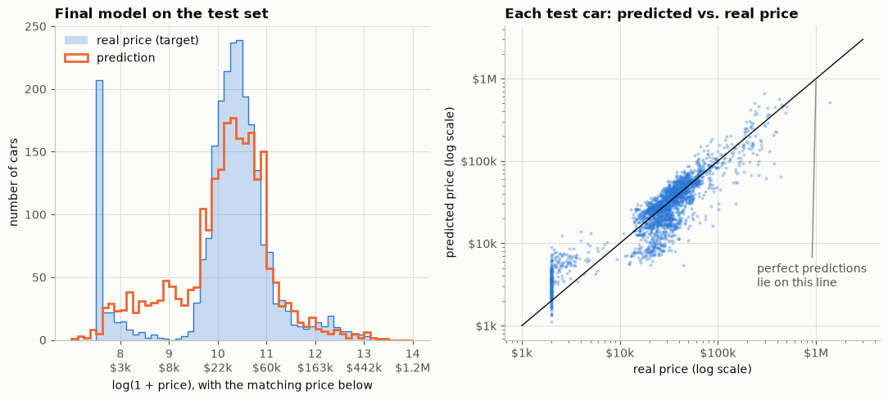
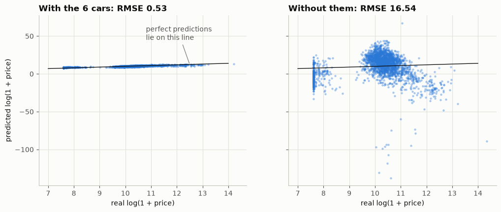
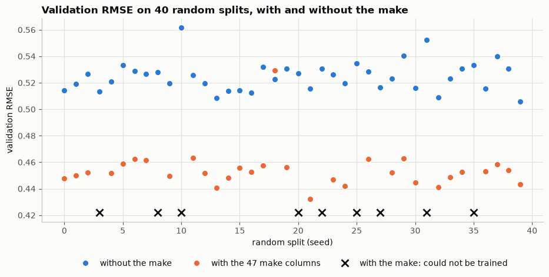
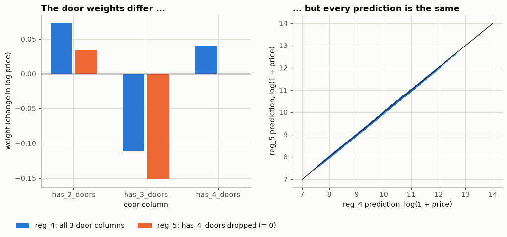
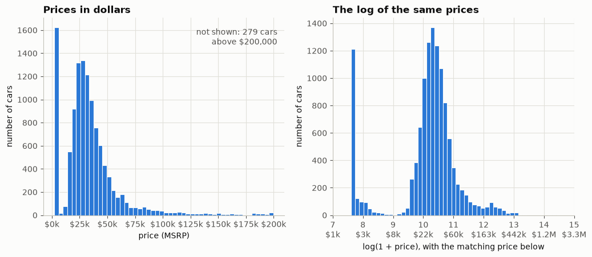

# Predicting car prices with linear regression

A linear regression model built from scratch with NumPy — no scikit-learn — that predicts a car's price
from its specifications. The model is solved directly from the normal equation, `w = (XᵀX)⁻¹Xᵀy`, which
means every numerical thing that can go wrong is visible instead of hidden behind a library call.

That turned out to be the interesting part. **This notebook is mostly a story about the model breaking**,
three times, in three different disguises, for the same underlying reason.

**Final result:** RMSE **0.4528** on the log price, measured on a test set that was touched exactly once,
at the end. In plain terms, the typical prediction lands about **25% away** from the real price.



*The final model on the held-out test set. Left: the prices it predicts against the prices that are really
there. Right: one dot per test car; dots on the line are perfect predictions. The spike at the far left of
both panels is the 203 test cars carrying a placeholder price of \$2,000 — more on that below.*

---

## Just want a number for your own car?

Section 14 exists for readers who would rather not work through the other thirteen. Run all cells, scroll to
the bottom, and edit the last one:

```python
my_car = dict(make='bmw', year=2012, engine_hp=200,
              highway_mpg=33, city_mpg=25, number_of_doors=4)
```

One caveat worth knowing before you read anything into the answer: the target is MSRP, the **new-car sticker
price**. So it estimates what a car cost in the showroom in its model year — not what a used one is worth
today. The model has never heard of mileage or condition.

---

## The one rule

Every failure in this notebook is the same rule being broken:

> **No column of the input matrix may be an exact recipe of the other columns.**

If one is, `XᵀX` has no inverse, the weights are not unique, and the model is meaningless. What makes it
worth a whole notebook is that it rarely announces itself:

| section | the redundant column | how it broke |
|---|---|---|
| 6 | `has_2_doors + has_3_doors + has_4_doors` equals the bias column | silent garbage — RMSE 16.5 |
| 9 | `popularity` is a per-make constant, so the make columns can rebuild it exactly | silent garbage — RMSE 95.2 |
| 10 | `make_is_genesis` is all zeros, because that split had no Genesis to train on | `LinAlgError` |

Only the third one raised an error. The first two returned confident, entirely wrong numbers — which is the
uncomfortable lesson: a broken linear regression looks exactly like a working one until you check the
condition number.



*The first disguise, from section 6. Same features, same code; the only difference is that six cars whose
door count was missing have been removed. Those six were the only rows where the three door columns did not
add up to the bias column — with them gone, one column became an exact recipe of the others, and the
predictions now run from −137 to +67 on a scale where a real car sits near 10.*

Section 11 fixes the third case with ridge regression, and the honest finding there is that ridge does
**not** make this model more accurate (0.4543 either way on the splits where both work). What it buys is
that the model trains on all 40 random splits instead of 31.

## Results

Each model scored on the validation set (seed 0):

| # | model | data | validation RMSE | what it shows |
|---|---|---|---|---|
| 1 | base features | `df` | 0.7734 | starting point |
| 2 | + `car_age` | `df` | 0.5301 | the age matters a lot |
| 3 | + 3 door columns | `df` | 0.5279 | barely changes; only works thanks to 6 cars |
| 4 | + 3 door columns | `df_corrected` | 16.5354 | dummy variable trap: broken |
| 5 | + `car_age` | `df_corrected` | 0.5146 | new baseline after removing the 6 cars |
| 6 | + 2 door columns | `df_corrected` | 0.5143 | fixed, but the doors add ~nothing |
| 7 | + 48 make columns | `df_corrected` | 111.2961 | dummy variable trap again |
| 8 | + 47 make columns | `df_corrected` | 95.2455 | still broken: `popularity` is a recipe |
| 9 | + 47 make columns, no `popularity` | `df_corrected` | **0.4478** | the make is a real improvement |
| 10 | … and ridge, r = 0.1 | `df_corrected` | 0.4478 | same accuracy, but always trainable |

**Final model on the held-out test set: 0.4528.**

Two features were tested and reported honestly rather than quietly dropped:

- **Number of doors** — measured across 40 random splits, the average improvement is −0.00001. It does not
  help. Section 8 says so.
- **Make** — +0.068 across the same 40 splits, helping on 30 of the 31 that could be trained. It does help.



*The make test, from section 10. Each point on the horizontal axis is one random split. The orange dots sit
clearly below the blue ones, by more than the splits differ among themselves, so the gain is real rather
than luck. The nine black crosses are the splits that raised `LinAlgError`: a make with three to five cars
in the entire dataset landed wholly outside the training half, leaving a column of zeros.*

## The same model with scikit-learn

[`car-price-prediction-scikit-learn.ipynb`](car-price-prediction-scikit-learn.ipynb) rebuilds the model step
by step with scikit-learn, on the identical split, as a check on the from-scratch version. Wherever the model
has a unique answer, the two agree to at least 13 decimal places, and the final test RMSE is the same 0.4528.

The interesting part is where they differ. scikit-learn's `LinearRegression` trains straight through the same
broken matrices, without an error or a warning:

| the redundant column | NumPy | scikit-learn |
|---|---|---|
| all three door columns, alongside the bias | RMSE 16.5 | RMSE 0.5143, `rank_` 7 of 8 |
| all 48 make columns and `popularity` (both traps at once) | RMSE 111.3 | RMSE 0.4478, `rank_` 53 of 55 |
| an all-zero make column (seed 20) | `LinAlgError` | RMSE 0.4543, `rank_` 52 of 53 |

It never inverts `XᵀX`. Its least-squares solver detects the redundant columns and returns the smallest of the
infinitely many equally good answers. The predictions survive, but the weights of the redundant columns stop
meaning anything, and the only sign is `rank_` coming out below the number of columns. The notebook also runs
into one scikit-learn function that is not so forgiving: `ridge_regression(..., return_intercept=True)`
quietly switches to an iterative solver that stops half-way on unscaled columns.



*What "the weights stop meaning anything" looks like. The two models disagree about what being a 2-door car
is worth — 0.073 against 0.033 — and agree on every single prediction to within 3.6 × 10⁻¹⁴. Only the
differences between the door weights are pinned down by the data, and those are identical in both.*

## The mathematics behind it

[`car-price-prediction-math.ipynb`](car-price-prediction-math.ipynb) explains why all of this happens, twice.
Part I uses plain language and four real cars (a Mustang, a Transit, a Civic and a Camry). Part II restates
every idea in linear algebra: least squares as a projection, rank and null space, singular values and the
condition number, the pseudoinverse, ridge shrinkage, and why gradient descent needs rescaled columns. Along
the way, the SVD rediscovers all three redundant columns on its own, down to every make's popularity value.

## What's in the repo

```
car-price-prediction.ipynb                the whole project, 14 sections, runs top to bottom
car-price-prediction-scikit-learn.ipynb   the same model rebuilt with scikit-learn, 11 sections
car-price-prediction-math.ipynb           the mathematics behind both, in plain language and linear algebra
data.csv                                  the dataset (also auto-downloaded if missing)
images/                                   the five charts shown above, exported from the notebooks
README.md                                 this file
```

The notebooks are written to be read in order. Every number quoted in their markdown was checked against a
fresh Restart & Run All.

## Running it

```bash
python -m venv .venv
.venv\Scripts\activate          # Windows
source .venv/bin/activate       # macOS / Linux

pip install numpy pandas scikit-learn matplotlib jupyter
jupyter notebook car-price-prediction.ipynb
```

scikit-learn is only needed for the second and third notebooks, Matplotlib for the charts in all three.
Written against Python 3.12, NumPy 2.5, pandas 3.0, scikit-learn 1.9 and Matplotlib 3.11. The pandas 3 part
matters: copy-on-write is always on, so the `df["col"].fillna(0, inplace=True)` idiom that most car-price
tutorials use silently does nothing here.

## The data

The Kaggle *Car Features and MSRP* dataset — 11,914 cars, 16 columns, model years 1990–2017, with the
manufacturer's suggested retail price as the target. `data.csv` is included for reproducibility; the
notebook's first cell also fetches it from
[`mlbookcamp-code`](https://github.com/alexeygrigorev/mlbookcamp-code) if it is missing.

The target is log-transformed (`np.log1p`), because prices run from $2,000 to $2,065,902 and a handful of
supercars would otherwise dominate every error.



*Why the log. Left: prices in dollars, with 279 cars too expensive to fit on the axis at all. Right: the
same prices after `np.log1p`, a roughly symmetric hill centred near \$30,000. The spike at the far left of
both panels is 1,036 cars priced at exactly \$2,000.*

## Known limitations

Listed in full at the end of the notebook. The main ones:

- A single ridge penalty `r` is applied to columns on wildly different scales, so it leans much harder on
  the 0/1 make columns than on `engine_hp`. The columns should be rescaled first.
- `fillna(0)` was applied to the whole table early on. Section 6 catches the damage to `number_of_doors`,
  but the same fill also filed 20 Mazda RX-7s and RX-8s under "0 cylinders" — which in this dataset means
  *electric*. They are rotary engines.
- 1,036 cars have an MSRP of exactly $2,000, every one of them built between 1990 and 2000. That is a
  placeholder, not a price, and it distorts anything the model learns about older cars.
- Model selection rests on one validation split. Cross-validation would be the better tool.

## Credits

Follows the car-price project from chapter 2 of Alexey Grigorev's *Machine Learning Bookcamp* / ML Zoomcamp,
with the analysis extended well past the original — the `popularity` collinearity, the all-zero-column
failure, the multi-seed feature tests and the ridge section are not in the source material.
